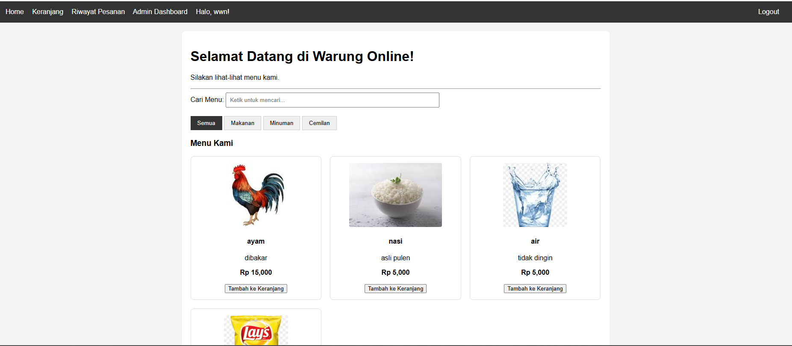

# Aplikasi Pemesanan Makanan Online (Food Ordering App)

Sebuah aplikasi web full-stack yang dibuat dengan Python (Flask) dan MongoDB. Aplikasi ini menyimulasikan sistem pemesanan makanan online dengan fitur untuk pengguna dan admin.

### Website Preview


## Fitur Utama

-   **Manajemen Pengguna**: Registrasi dan Login pengguna.
-   **Otorisasi Berbasis Peran**: Peran `Admin` dan `User` dengan hak akses yang berbeda.
-   **Manajemen Menu (CRUD)**: Admin dapat menambah, melihat, mengedit, dan menghapus item menu.
-   **Pencarian & Filter**:
    -   *Live search* untuk mencari menu secara real-time saat pengguna mengetik.
    -   Filter menu berdasarkan kategori.
-   **Keranjang Belanja Interaktif**: Pengguna dapat menambah, mengupdate kuantitas, dan menghapus item dari keranjang.
-   **Proses Checkout**: Memindahkan item dari keranjang menjadi pesanan permanen.
-   **Riwayat Pesanan**: Pengguna dapat melihat riwayat semua pesanan yang pernah mereka buat.

## Teknologi yang Digunakan

-   **Backend**: Python 3, Flask
-   **Database**: MongoDB
-   **Frontend**: HTML, CSS, JavaScript (Vanilla)
-   **Library Python**: PyMongo, Bcrypt, Jinja2

## Prasyarat

Sebelum menjalankan proyek ini, pastikan Anda sudah menginstal:
-   Python 3.8 atau yang lebih baru
-   `pip` (biasanya sudah terinstal bersama Python)
-   MongoDB Community Server Local (MongoDB Compass).

## Instalasi & Menjalankan Proyek

Berikut adalah langkah-langkah untuk menjalankan proyek ini di lingkungan lokal:

1.  **Clone Repositori**
    ```bash
    git clone https://github.com/Obiwannn11/food-app-bdnr.git
    cd food-app-bdnr
    ```

2.  **Buat dan Aktifkan Virtual Environment**
    ```bash
    # Buat environment
    py -m venv food_app

    # Aktifkan di Windows
    food_app\Scripts\activate.ps1

    # Aktifkan di macOS/Linux
    source venv/bin/activate
    ```

3.  **Install Semua Dependensi**
    Gunakan file `requirements.txt` yang sudah disediakan untuk menginstal semua library yang dibutuhkan.
    ```bash
    pip install -r requirements.txt
    ```

4.  **Pastikan Server MongoDB Berjalan**
    Aplikasi ini akan mencoba terhubung ke server MongoDB di komputer lokal Anda. Cukup pastikan service MongoDB Anda sudah aktif.

5.  **Jalankan Aplikasi Flask**
    ```bash
    py app.py
    ```

6.  **Buka Aplikasi**
    Buka browser web Anda dan kunjungi alamat: `http://127.0.0.1:5000`

## Konfigurasi Database

Aplikasi ini dikonfigurasi untuk terhubung ke instance MongoDB lokal secara default dengan pengaturan sebagai berikut:

-   **Host**: `localhost`
-   **Port**: `27017`
-   **Nama Database**: `food_app_db` (seperti yang didefinisikan di dalam `app.py`)

Jika Anda menggunakan konfigurasi MongoDB yang berbeda, Anda bisa mengubah variabel `MONGO_URI` di bagian atas file `app.py`.
